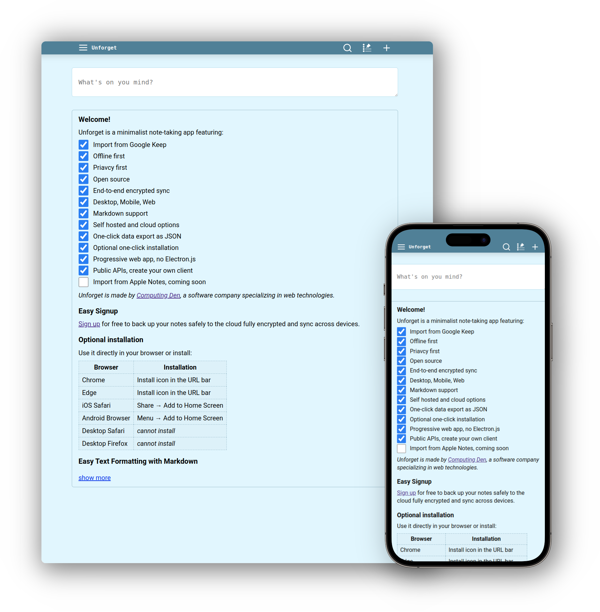

# Unforget



*Start now without registering at [unforget.computing-den.com](https://unforget.computing-den.com/demo).*

Unforget is a minimalist, offline-first, and end-to-end encrypted note-taking app (without Electron.js) featuring:

- [x] Offline first
- [x] Privacy first
- [x] Progressive web app
- [x] Open source MIT License
- [x] End-to-end encrypted sync
- [x] Desktop, Mobile, Web
- [x] Markdown support
- [x] Self hosted and cloud options
- [x] One-click data export as JSON
- [x] Optional one-click installation
- [x] Public APIs, create your own client
- [x] Import Google Keep
- [x] Import Apple Notes
- [x] Import Standard Notes


*Unforget is made by [Computing Den](https://computing-den.com), a software company specializing in web technologies.*

*Contact us at sean@computing-den.com*


# Easy Signup

[Sign up](https://unforget.computing-den.com/login) for free to back up your notes safely to the cloud fully encrypted and sync across devices.

*No email or phone required.*

# Optional installation

Use it directly in your browser or install:

| Browser         | Installation                |
|-----------------|-----------------------------|
| Chrome          | Install icon in the URL bar |
| Edge            | Install icon in the URL bar |
| Android Browser | Menu → Add to Home Screen   |
| Safari Desktop  | Share → Add to Dock         |
| Safari iOS      | Share → Add to Home Screen  |
| Firefox Desktop | *cannot install*            |
| Firefox Android | Install icon in the URL bar |

# Organization and Workflow

Notes are organized **chronologically**, with pinned notes displayed at the top.

This organization has proven very effective despite its simplicity. The **search is very fast** (and done offline), allowing you to quickly narrow down notes by entering a few phrases. Additionally, you can search for non-alphabetic characters, enabling the use of **tags** such as #idea, #project, #work, #book, etc.

There is **no limit** to the size of a note. For larger notes, you can insert a `---` on a line by itself to **collapse** the rest of the note.

Notes are **immediately saved** as you type and synced every few seconds.

If you edit a note from two devices and a **conflict** occurs during sync, the most recent edit will take precedence.

# Security and Privacy

Unforget does not receive or store any personal data. No email or phone is required to sign up. As long as you pick a strong password, your notes will be stored in the cloud fully encrypted and safe.

Only your username and note modification dates are visible to Unforget servers.

# Text Formatting

The main differences with the [Github flavored markdown](https://github.github.com/gfm/) are:
- If the first line of a note is followed by a blank line, it is a H1 header.
- Anything after the first horizontal rule `---` in a note will be hidden and replaced with a "show more" button that will expand the note.

~~~
# H1 header
## H2 header
### H3 header
#### H4 header
##### H5 header
###### H6 header

*This is italic.*.

**This is bold.**.

***This is bold and italic.***

~~This is strikethrough~~


- This is a bullet point
- Another bullet point
  - Inner bullet point
- [ ] This is a checkbox
  And more text related to the checkbox.

1. This is an ordered list item
2. And another one

[this is a link](https://unforget.computing-den.com)

Inline `code` using back-ticks.

Block of code:

```javascript
function plusOne(a) {
  return a + 1;
}
```


| Tables        | Are           | Cool  |
| ------------- |:-------------:| -----:|
| col 3 is      | right-aligned | $1600 |
| col 2 is      | centered      |   $12 |


Horizontal rule:

---


~~~

# Build and Self Host

To build Unforget for production, put a `.env` file in the project's root directory:

```
PORT=3000
NODE_ENV=production
DISABLE_CACHE=0
LOG_TO_CONSOLE=0
FORWARD_LOGS_TO_SERVER=0
FORWARD_ERRORS_TO_SERVER=0
```

and then run

```
cd unforget/
npm run build
npm run start

```

It is recommended to use [Nginx as a reverse proxy](https://docs.nginx.com/nginx/admin-guide/web-server/reverse-proxy/) and set up SSL certificate using [Let's Encrypt](https://letsencrypt.org/).

# Development

To build and run Unforget in development mode, put a `.env` file in the project's root directory:

```
PORT=3000
NODE_ENV=development
DISABLE_CACHE=1
LOG_TO_CONSOLE=1
FORWARD_LOGS_TO_SERVER=0
FORWARD_ERRORS_TO_SERVER=0
```

and then run

```
cd unforget/
npm run dev

```

This will build the project and watch for changes in the source files.

# Public APIs - write your own client

Here, all paths are relative to either the official server at [https://unforget.computing-den.com](https://unforget.computing-den.com) or your own server if you're self hosting.

## Examples

In the [examples/](examples/) directory you will find example code for TypeScript and Python.

To run the **Typescript** example:

``` bash
cd examples/

# Signup
npx tsx example.ts signup USERNAME PASSWORD

# Login
npx tsx example.ts login USERNAME PASSWORD

# Create new note
npx tsx example.ts create "Hello world!"

# Get all notes
npx tsx example.ts get

# Get note by ID
npx tsx example.ts get ID
```

To run the **Python** example:

``` bash
cd examples/

# Signup
python3 example.py signup USERNAME PASSWORD

# Login
python3 example.py login USERNAME PASSWORD

# Create new note
python3 example.py create "Hello world!"

# Get all notes
python3 example.py get

# Get note by ID
python3 example.py get ID
```

## Note Types

```ts
type Note = {

  // UUID version 4
  id: string;

  // Deleted notes have text: null
  text: string | null;

  // ISO 8601 format
  creation_date: string;
  
  // ISO 8601 format
  modification_date: string;
  
  // 0 means deleted, 1 means not deleted
  not_deleted: number;
  
  // 0 means archived, 1 means not archived
  not_archived: number;
  
  // 0 means not pinned, 1 means pinned
  pinned: number;

  // A higher number means higher on the list
  // Usually, by default it's milliseconds since the epoch
  order: number;

}

type EncryptedNote = {

  // UUID version 4
  id: string;

  // ISO 8601 format
  modification_date: string;
  
  // The encrypted Note in base64 format
  encrypted_base64: string;
  
  // Initial vector, a random number, that was used for encrypting this specific note
  iv: string;

}

```

The server only knows about ```EncryptedNote``` and never sees the actual ```Note```. So, the client must encrypt before sending to and decrypt after receiving notes from the server.

Side note: the reason for using number (0 and 1) instead of boolean is to make it easier to store notes in SQLite which doesn't support boolean. And the reason why some of these fields are flipped (```not_deleted``` instead of ```deleted```) is to facilitate the use of IndexedDB which doesn't support indexing by multiple keys in arbitrary order.


## Signup, Login, Logout

To sign up, send a POST request to ```/api/signup``` with a JSON payload of type ```SignupData```:

```ts
type SignupData = {
  username: string;
  password_client_hash: string;
  encryption_salt: string;
}
```

To log in, send a POST request to ```/api/login``` with a JSON payload of type ```LoginData```:

```ts
type LoginData = {
  username: string;
  password_client_hash: string;
}
```

In both cases, if the credentials are wrong you will receive a 401 error. Otherwise, the server will respond with ```LoginResponse``` and code 200:

```ts
type LoginResponse = {
  username: string;
  token: string;
  encryption_salt: string;
}
```

To log out, send a POST request to ```/api/login?token=TOKEN```

In the following sections, all the requests to the server must include the ```token``` either as a query parameter in the URL (e.g. ```/api/delta-sync?token=XXX```) or as a cookie named ```unforget_token```.

Notice that we never send the raw password to the server. Instead we calculate its hash as ```password_client_hash``` which is derived from the username, password, and a static random number. It is important to use the exact same algorithm for calculating the hash if you want to be able to use the official Unforget client as well as your own. The ```encryption_salt``` is a random number used to derive the key for encryption and decryption of notes. It is stored on the server and provided on login. The [examples](#examples) show how to calculate the hash and generate the salt.

## Get Notes

Send a POST request to ```/api/get-notes?token=TOKEN``` to get all notes. Optionally you can provide a JSON payload of type ```{ids: string[]}``` to get specific notes.

You will receive ```EncryptedNote[]```.

## Merge Notes

Send a POST request to ```/api/merge-notes?token=TOKEN``` with a JSON payload of type ```{notes: EncryptedNote[]}```.

If the note doesn't already exist, it will be added.
If its ```modification_date``` is larger than the existing note, it will replace the existing note.
Otherwise, it will be thrown away.

## Delete Notes

To delete a note set its `text: null` and `not_deleted: 0` and [merge](#merge-notes) it. This way, the stub will stay in the database and the fact that it was deleted will propogate to all the other clients.

## Sync and Merge

For a long-running client, instead of using [Get Notes](#get-notes) and [Merge Notes](#merge-notes), you can use sync in the following manner.

The client and the server each maintain a queue of changes to send to each other as well as a sync number. The exchange of these changes is called a **delta sync**.

The sync number is 0 at login and is incremented by each side only after all the received changes have been merged and stored. At the start of each delta sync, if their sync numbers differ, it indicates that something went wrong in the last delta sync and so they must do a queue sync.

A **queue sync** is when each side sends its sync number along with a list of IDs and modification dates of all the notes that it knows about. After a queue sync, both sides will know which changes the other side lacks and therefore can update their own queue and sync number.

When the sync number is 0 (immediately after login), the server will send all notes in the first delta sync.

To perform a **delta sync**, send a POST request to ```/api/delta-sync?token=TOKEN``` with a JSON payload of type ```SyncData```:

```ts
type SyncData = {
  notes: EncryptedNote[];
  syncNumber: number;
}
```

If the server agrees with the ```syncNumber```, it will respond with ```DeltaSyncResNormal``` which includes the changes stored on the server for that client since the last sync. Otherwise, the server will respond with ```PartialSyncResRequireQueueSync``` requiring the client to initiate a queue sync.

```ts
type DeltaSyncResNormal = {
  type: 'ok';
  notes: EncryptedNote[];
  syncNumber: number;
}

type DeltaSyncResRequireQueueSync = {
  type: 'require_queue_sync';
}
```

To perform a **queue sync**, send a POST request to ```/api/queue-sync?token=TOKEN``` with a JSON payload of type ```SyncHeadsData``` including the heads of all the notes known by the client and its sync number. You will then receive another ```SyncHeadsData``` including the heads of all the notes known by the server for that user along with the server's sync number for that client.

```ts
type SyncHeadsData = {
  noteHeads: NoteHead[];
  syncNumber: number;
}

type NoteHead = {
  id: string;
  modification_date: string;
}
```

After a queue sync, each side updates its queue to include the changes the other side is mising as well as setting the new sync number to be the larger sync number + 1.

It is important that the client and the server agree on how the **merging** of the notes is done so that they end up with a consistent state. We say that note A must replace note B if ```A.id == B.id``` and ```A.modification_date > B.modification_date```.

## Encryption and Decryption

The details of encryption and decryption are more easily explained in code. See the [Examples](#examples) section.

## Error handling

All the API calls will return an object of type ```ServerError``` when encountering an error with a status code >= 400:

```ts
type ServerError {
  message: string;
  code: number;
  type: 'app_requires_update' | 'generic';
}
```

If you receive an error with type ```app_requires_update``` that indicates that you are using an older version of the API that is no longer supported.
